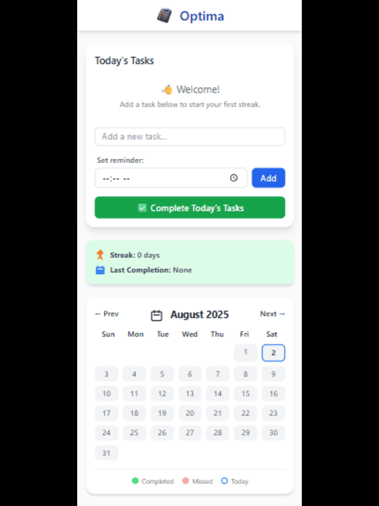

# 📅 Daily Task Tracker

A **simple, mobile-first Progressive Web App (PWA)** to track daily tasks, maintain streaks, and stay consistent.

> Empower your productivity — one day at a time.

---

## ✨ Features

- ✅ Add and remove daily tasks
- 🔁 Mark tasks as complete and track streaks
- 📆 Calendar view with completed dates highlighted
- 📱 Mobile-first, responsive design
- 💾 Offline support (PWA)
- 📲 Installable on mobile or desktop
- ☁️ Deployed via [Vercel](https://vercel.com)

---

## 🧠 Tech Stack

- HTML5
- Tailwind CSS (via CDN)
- JavaScript (Vanilla)
- PWA (Service Worker + Manifest)

---

## 📸 Screenshot



> _Replace this image with a screenshot of your app UI._

---

## 🚀 Getting Started Locally

1. Clone the repo:

```
git clone https://github.com/your-username/task-tracker.git
cd task-tracker

---

2. Open index.html in your browser:

✅ Works offline after initial load!

```
## 🛠️ Customize Tasks
Edit index.html and locate the following section:

html
    <ul id="task-list">
        <li><label><input type="checkbox"> JS Sessions (10am - 12pm)</label></li>
        <li><label><input type="checkbox"> UI/UX Lessons (2pm - 4pm)</label></li>
        <li><label><input type="checkbox"> Code Practice (4pm - 5pm)</label></li>
        <li><label><input type="checkbox"> Backtesting & Journaling (9pm - 12am)</label></li>
    </ul>
You can edit or add more tasks as needed.

```

## 🧱 Deployment (Vercel)
Push your project to GitHub.

Go to vercel.com, log in with GitHub.

Click "New Project", import your repo.

Deploy with default settings.

Once deployed, your PWA will be installable and accessible offline!

```

## 📦 PWA Info
This project includes:

manifest.json — Defines app name, icon, and display mode.

service-worker.js — Caches files for offline access.

To test the PWA locally:

Use a local server (Live Server or npx serve)

Open in Chrome → DevTools → Application → Manifest

Click Install or Add to Home Screen

🧑‍💻 Author
Marshall Uzoma
🔗 GitHub
```
